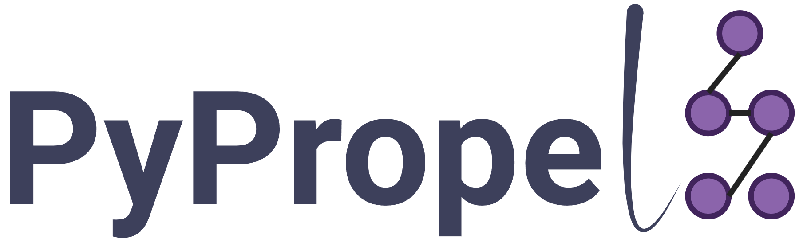

!!! success ""

    # { width="80"} Welcome to using PyPropel!


PyPropel provides a Python interface to better pre-processing protein data and post-processing.

* **pre-processing**: interaction sites, protein datasets, protein features, etc.

* **post-processing**: statistics plot, evaluation, protein functional classes, etc.

You only need one line to use PyPropel in Python.

``` py
import pypropel as pp
```

## Features

!!! abstract "Features"

    - [x] Protein
        * [x] Alignment
        * [x] Sequence
        * [x] Structre
    - [x] Technical
        * [x] PyPI
        * [x] Conda
        * [x] Docker
        * [x] Github
    - [x] Unique module
        * [x] Feature engineering
        * [x] One-stop dataset generation
