We walk you through a detailed, hands-on tutorial in **predicting interaction sites in transmembrane proteins** using **PyPropel** in tandem with **TMKit**, an external tool specialising in sequence analysis of transmembrane proteins.

You will specifically see how **PyPropel** and **TMKit** can batch pre-process the structures of 10,971 protein complexes files (including structures of 58,060 protein chains). Finally, we will put the generated data for machine learning using **scikit-learn**.

It includes 5 modules:

!!! tip "Features"

    * :material-package-variant: Pre-processing
    * :material-pencil-box-multiple-outline: Feature extraction
    * :fontawesome-solid-code-pull-request: Machine learning with random forest
    * :fontawesome-solid-code-pull-request: Machine learning evaluation metrics
    * :material-chart-scatter-plot: Visualisation of evaluation metrics


Let's first import both of the libraries.

:material-language-python: Python
``` py linenums="1"
import pypropel as pp
import tmkit as tmk
```

Additionally, we will also use **NumPy** and **Pandas** for quickly processing data.

:material-language-python: Python
``` py linenums="1"
import numpy as np
import pandas as pd
```

## 1. Pre-processing

### 1.1 Downloading a PDBTM database

Then, we can download an up-to-date list of transmembrane proteins  from the PDBTM database (version: **`12.06.2024`**). Here, we also attach other two lists (version: **`06.30.2023`** and **`10.02.2023`**), which were previously downloaded. The latest version of transmembrane proteins can be found [here](https://pdbtm.unitmp.org/data/PDBTM/data/pdbtm_alpha.txt).

:material-language-python: Python
``` py linenums="1"
pdb_fpn_dict = {
    '06.30.2023': 'data/database/pdbtm_alpha_06.30.2023.txt',
    '10.02.2023': 'data/database/pdbtm_alpha_10.02.2023.txt',
    '12.06.2024': 'data/database/pdbtm_alpha_12.06.2024.txt',
}
```


Check whether the latest list of proteins have been duplicated between one another due to technical errors. Then, save the deduplicated list of proteins (if you use version **`12.06.2024`** for example).

:material-language-python: Python
``` py linenums="1"
df_latest = df_latest.drop_duplicates()

pp.io.write(
    sv_fpn='data/database/pdbtm_alpha_12.06.2024.txt',
    df=df_latest,
    df_sep='\t',
    header=None,
)
```


We read every two latest lists for getting the updated proteins.

:material-language-python: Python
``` py linenums="1"
df_old = pp.io.read(
    df_fpn=pdb_fpn_dict['06.30.2023'],
    # df_fpn=pdb_fpn_dict['10.02.2023'],
    # df_fpn=pdb_fpn_dict['12.06.2024'],
    df_sep='\t',
    header=None,
)
print(df_old)

df_latest = pp.io.read(
    # df_fpn=pdb_fpn_dict['06.30.2023'],
    # df_fpn=pdb_fpn_dict['10.02.2023'],
    df_fpn=pdb_fpn_dict['12.06.2024'],
    df_sep='\t',
    header=None,
)
print(df_latest)
```


Find the portion of proteins updated in the latest version of PDBTM. Then, store it as `prot_series`.

:material-language-python: Python
``` py linenums="1"
pds_diff, psd_rept = pp.io.list_diff_unipartite(
    pds_lg=df_latest[0],
    pds_sm=df_old[0],
    # sv_diff_fpn='data/database/diff.txt',
    # sv_rept_fpn='data/database/repeat.txt',
    sv_diff_fpn=None,
    sv_rept_fpn=None,
)
print(pds_diff)
print(psd_rept)

df = pd.DataFrame()
df['prot'] = pds_diff.apply(lambda x: x[:4])
df['chain'] = pds_diff.apply(lambda x: x[-1:])
df['ij'] = df.apply(lambda x: x['prot'] + '.' + x['chain'], axis=1)
print(df)
prot_series = pd.Series(df['prot'].unique())
print(prot_series)
```


Retrive PDBTM structures and store them in `data/pdbtm/cplx/`. As the protein structures are transposed from RCSB PDB files, it is necessary to denote `kind` as `tr`.

:material-language-python: Python
``` py linenums="1"
tmk.seq.retrieve_pdb_from_pdbtm(
    prot_series=prot_series,
    kind='tr',
    sv_fp='data/pdbtm/cplx/',
)
```


Retrive PDBTM XML files (useful for getting topological information) and store them in `data/xml/`.

:material-language-python: Python
``` py linenums="1"
tmk.seq.retrieve_xml_from_pdbtm(
    prot_series=prot_series,
    sv_fp='data/xml/',
)
```

### 1.2 Cleaning structural data

We can go on with how we extract the structure of each chain from a protein complex structure stored in PDB.

There are two ways to get the list of chains with respect to their proteins.

*Option 1*.
Fetch all structures gathered accumulatively from updated list. This is because in each updated list, some proteins from previous lists go away yet have been downloaded. We need to include those that go away.

:material-language-python: Python
``` py linenums="1"
df = pp.io.find_from_folder(
    file_path='data/pdbtm/cplx/',
    suffix='.pdb',
    flag=1,
    # sv_fpn=None,
    sv_fpn='data/cplx.txt',
)
print(df)
```

Then, we can use `pp.str.chains` to get all chains from the complex structure of each protein. After then, we save the list.

``` py linenums="1"
a = []
for i in df.index:
    try:
        chains = pp.str.chains(
            pdb_fp='data/pdbtm/cplx/',
            pdb_name=df[0][i],
        )
        print(i, df[0][i], chains)
        for j in chains:
            a.append([df[0][i], j])
    except:
        continue
pp.io.write(
    df=pd.DataFrame(a),
    sv_fpn='data/database/pdbtm_alpha_accumulated.txt',
    df_sep='\t',
)
df = pp.io.read(
    df_fpn='data/database/pdbtm_alpha_accumulated.txt',
    df_sep='\t',
    header=None,
).rename(columns={0: 'prot', 1: 'chain'})
print(df)
```

*Option 2*.
Get chains from all previously gathered lists of proteins by getting the union of all of them. We can do like this. 

!!! warning

    Make sure each time we have two headers `prot` and `chain` in the dataframe (`df`) for indicating proteins and chains. Because other functions might need this information as required.

:material-language-python: Python
``` py linenums="1"
df = pd.concat([pp.io.read(i) for i in [*pdb_fpn_dict.values()]]).drop_duplicates().reset_index(drop=True)
df['prot'] = pds_diff.apply(lambda x: x[:4])
df['chain'] = pds_diff.apply(lambda x: x[-1:])
print(df)
```

Then, use the `pp.dataset.download_pack` function to extract the structures of all chains from the structures of all protein complexes. To this end, we need to specify where complexes are located (e.g. `data/pdbtm/cplx/`) and where structures of all chains are to be stored (e.g. `data/pdb/`).

!!! note

    Please note that `pp.dataset.download_pack` will also refine the structures of all chains (see [this page](https://2003100127.github.io/pypropel/tutorial/protein/IO/structure/)). It includes reformatting structures and removing `HETATM`. It will also tell you if the sequence of a protein chain stored in `XML` file is the same as it is in the PDB file. It will extract the sequence to be stored in the `FASTA` format.

:material-language-python: Python
``` py linenums="1"
pp.dataset.download_pack(
    prot_df=df,
    pdb_cplx_fp='data/pdbtm/cplx/',
    pdb_fp='data/pdb/',
    xml_fp='data/xml/',
    fasta_fp='data/fasta/',
)
```

You will see the files as shown in the following screenshoots.

<figure markdown="span">
  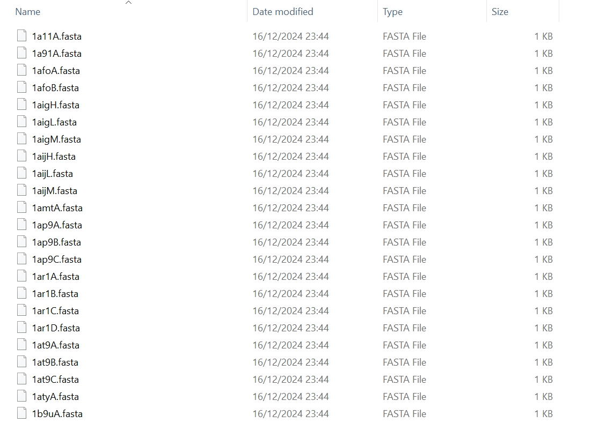{ width="400" }
  <figcaption><strong>Fig</strong>. Split Fasta files per chain</figcaption>
</figure>

<figure markdown="span">
  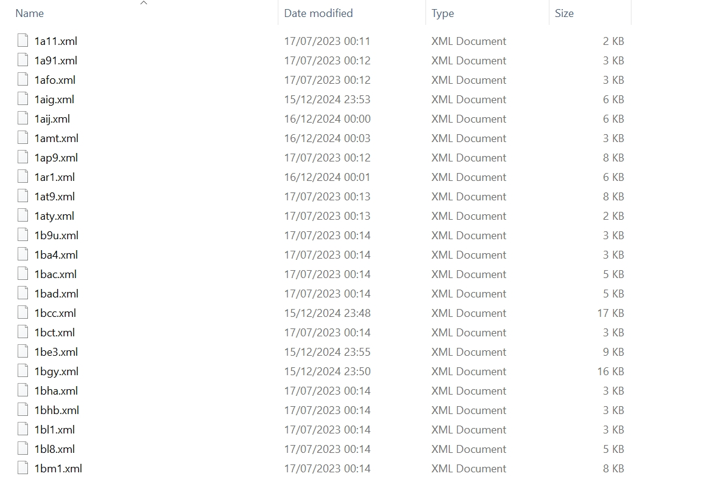{ width="400" }
  <figcaption><strong>Fig</strong>. Downloaded XML files</figcaption>
</figure>

<figure markdown="span">
  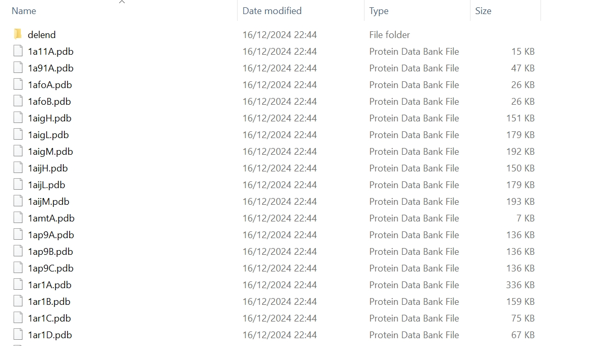{ width="400" }
  <figcaption><strong>Fig</strong>. Split PDB files per chain</figcaption>
</figure>


### 1.3 Quality control of data

After these files above are obtained, everything is all set before we exactly work on quality control (QC) of the sequence, topological, and structural data.

We can use `tmk.qc.integrate` or `tmk.qc.obtain_single` to obtain the metrics that we can use to remove or retain protein chains for analysis.

For simplicity, we showcase the generation of each metric based on a metric given. We are interested in `nchain`, `rez`, `met`, `mthm`, `seq`, corresponding to the numebr of chains in a protein complex, resolution, resolving experimental method, number of transmembrane helices, and amino acid sequences. Apart from these, we can also order the generation of something extra by using `bio_name`, `head`, and `desc` for how the protein is named biologically and what is the head of the PDB file, and general description of the protein strucuture.

:material-language-python: Python
``` py linenums="1"
df_qc_sgl = tmk.qc.obtain_single(
    df_prot=df_prot,
    pdb_cplx_fp=to('data/ex/pdbtm/'),
    fasta_fp=to('data/ex/fasta/'),
    xml_fp=to('data/ex/xml/'),
    sv_fp=to('data/ex/'),
    metric='nchain',
)
print(df_qc_sgl)

# df_integ = tmk.qc.integrate(
#     df_prot=df,
#     pdb_cplx_fp='data/pdbtm/cplx/',
#     fasta_fp='data/fasta/',
#     xml_fp='data/xml/',
#     sv_fp='data/qc/',
#     metrics=[
#         'nchain',
#         # 'rez',
#         # 'met',
#         # 'mthm',
#         # 'seq',
#
#         # 'bio_name', 'head', 'desc',
#     ],
# )
# print(df_integ)
```

Then, you will see

<figure markdown="span">
  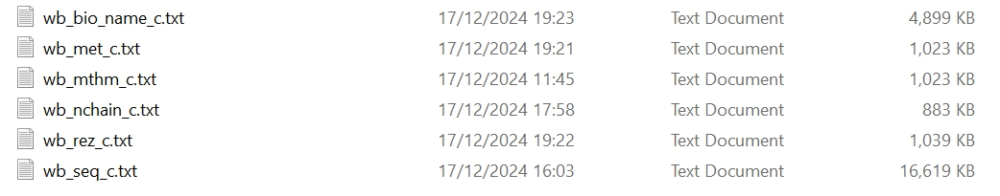{ width="600" }
  <figcaption><strong>Fig</strong>. Files of QC metrics</figcaption>
</figure>

Then, we can do a separate coding procedure for integrating these metrics together within a single file by using the following codes.

:material-language-python: Python
``` py linenums="1"
qc_fpn_dict = {
    'met': 'data/qc/wb_met_c.txt',
    'mthm': 'data/qc/wb_mthm_c.txt',
    'nchain': 'data/qc/wb_nchain_c.txt',
    'rez': 'data/qc/wb_rez_c.txt',
    'bio_name': 'data/qc/wb_bio_name_c.txt',
}
df = pp.io.read(
    df_fpn='data/qc/wb_seq_c.txt',
    df_sep='\t',
    header=None,
).rename(
    columns={
        0: 'prot',
        1: 'chain',
        2: 'prot_mark',
        3: 'seq',
        4: 'len_seq',
    }
)
print(df)
for metric, fpn in qc_fpn_dict.items():
    df[metric] = pp.io.read(
        df_fpn=fpn,
    )[3]
print(df)
pp.io.write(
    df=df,
    sv_fpn='data/qc/integrate.xlsx',
    header=True,
    kind='excel',
)
```

### 1.4 Integrtation of QC metrics

<figure markdown="span">
  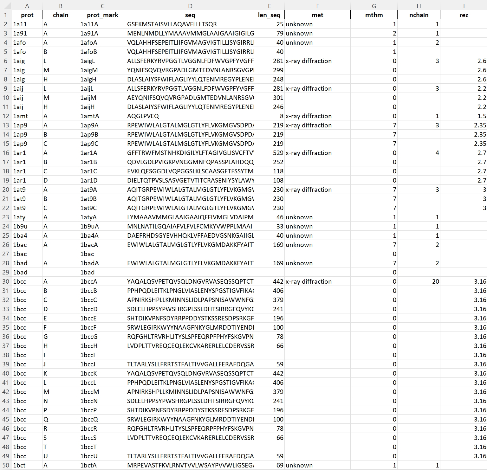{ width="600" }
  <figcaption><strong>Fig</strong>. vignette of integrtated QC metrics</figcaption>
</figure>

But you should see the problem now, for metrics `met` and `nchain`, blanks remain not filled out. This is because, we generate them at the protein complex level rather than protein chain level. But within the metric file, proteins are rendered at the protein chain levels. Thus, we need to step up the fill of the two metrics in the table. We can make it by

:material-language-python: Python
``` py linenums="1"
df = pp.io.read(
    df_fpn='data/qc/integrate.xlsx',
    sheet_name='Sheet1',
    header=0,
    kind='excel',
)
print(df)
df_ = df.dropna(subset=['met'])[['prot', 'met']]
df_nchain = pd.read_csv(
    'data/qc/wb_nchain_c.txt',
    header=None,
    sep='\t',
).dropna()
nchain_map = pd.Series(df_nchain[3].values, index=df_nchain[0]).to_dict()
met_map = pd.Series(df_['met'].values, index=df_['prot']).to_dict()
# print(met_map)
# print(nchain_map)
met_keys = [*met_map.keys()]
nchain_keys = [*nchain_map.keys()]
import numpy as np
df['nchain'] = df['prot'].apply(lambda x: nchain_map[x] if x in nchain_keys else np.nan)
df['met1'] = df['prot'].apply(lambda x: met_map[x] if x in met_keys else np.nan)
print(df.prot.unique().shape[0])
df.to_excel('data/qc/integrate1.xlsx',)
```

This results in a file called `integrate1.xlsx`. We can see the blanks have all been filled out for the two metrics.

<figure markdown="span">
  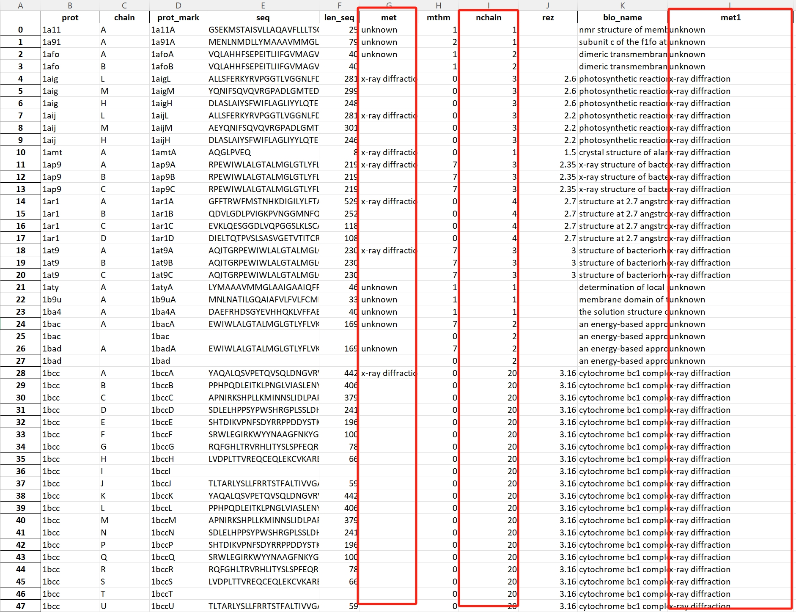{ width="600" }
  <figcaption><strong>Fig</strong>. Stepping up the fill area of `met` and `nchain`</figcaption>
</figure>


### 1.5 Generating datasets

Next, we can screen protein chains by setting restrictions, thus generating a dataset.

:material-language-python: Python
``` py linenums="1"
df = pp.io.read(
    'data/qc/integrate1.xlsx',
    sheet_name='Sheet1',
    header=0,
    kind='excel',
)
print(df)
print(df.columns)
df = df.loc[
    (df['rez'] < 3.5)
    & (df['mthm'] >= 2)
    # & (df['len_seq'] >= 100)
    & (df['len_seq'] < 1000)
    & (df['met1'] == 'x-ray diffraction')
    & (df['nchain'] >= 2)
]
print(df.shape[0])
print(df.prot.unique().shape[0])
print(df)
pp.io.write(
    df=df,
    sv_fpn='data/qc/dataset.xlsx',
    df_sep='\t',
    header=True,
    kind='excel',
)
```

This results in a dataset of 7148 protein chains screened for use.

<figure markdown="span">
  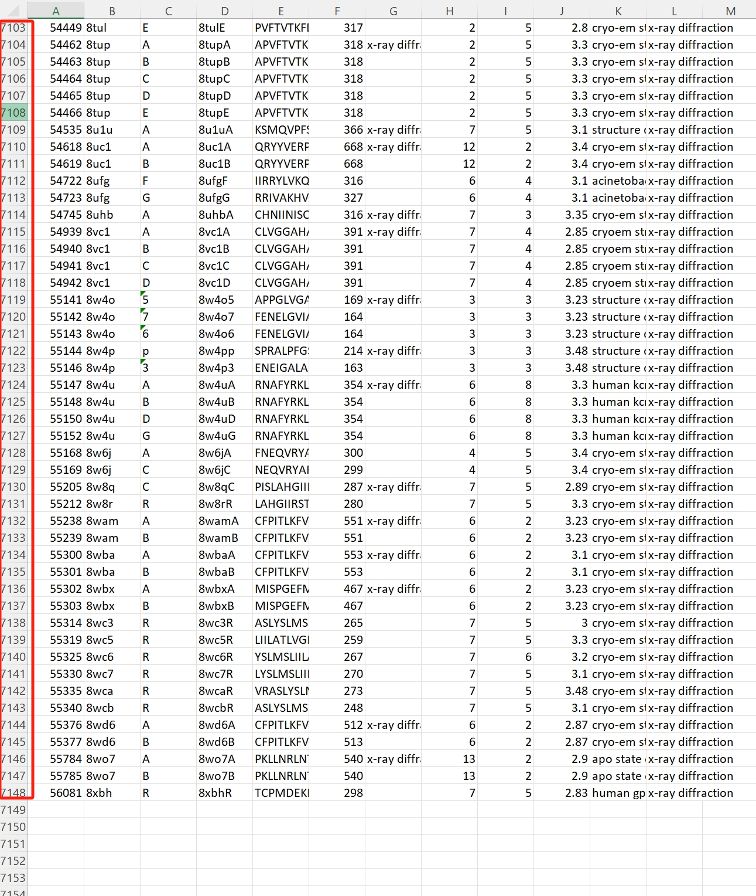{ width="600" }
  <figcaption><strong>Fig</strong>. Dataset</figcaption>
</figure>

For all of these protein complexes with at least two protein chains, we need to calculate if protein chains within the complexes are spatially and physically in interaction. This information will be treated as the labels of each protein site. We can achieve this with two ways. We can rekcon two protein chains as being in interaction if their distance is within an angstrom (Å) of 5.5.

1. Batch processing them on cloud. 

:material-language-python: Python
``` py linenums="1"
df = pfreader().generic(df_fpn=to('data/qc/dataset.xlsx'), header=0)
prots = df.prot.unique()

param_config = {
    'pdb_fp': '-fp',
    'pdb_fn': '-fn',
    'sv_fp': '-op',
}
value_config = {
    'tool_fp': '/path/to/your/conda environment/python',
    'script_fpn': './Complex.py',
    'pdb_fp': '/path/to/protein complex files/',
    'sv_fp': '/path/to/save/results/',
}

for key, prot in enumerate(prots):
    order_list = [
        value_config['tool_fp'],
        value_config['script_fpn'],

        param_config['pdb_fp'], value_config['pdb_fp'],
        param_config['pdb_fn'], prot,
        param_config['sv_fp'], value_config['sv_fp'],
    ]
    pp.dist.cloud_check(
        order_list=order_list,
        job_fp='/path/to/save/job files/',
        job_fn=str(key),
        cpu=2,
        memory=10,
        method='script',
        submission_method='sbatch',
    )
```

2. (Recommend) Or, you can still generate all of them on your own computer by the following code. This might take long to take all. You can simply extract a small portion of these proteins for training purposes. Then, if you famililarise them, you could perform all of these operations on cloud.

:material-language-python: Python
``` py linenums="1"
df = pp.io.read(df_fpn=to('data/qc/dataset.xlsx'), header=0, kind='excel')
prots = df.prot.unique()
for key, prot in enumerate(prots):
    pp.dist.check_chain_complex(
        pdb_fp=to('data/pdb/complex/pdbtm/'),
        prot_name='1aij',
        sv_fp=to('data/pdb/complex/pdbtm/'),
        thres=5.5,
    )
```

This will result in a lot of text files per protein complex. 

<figure markdown="span">
  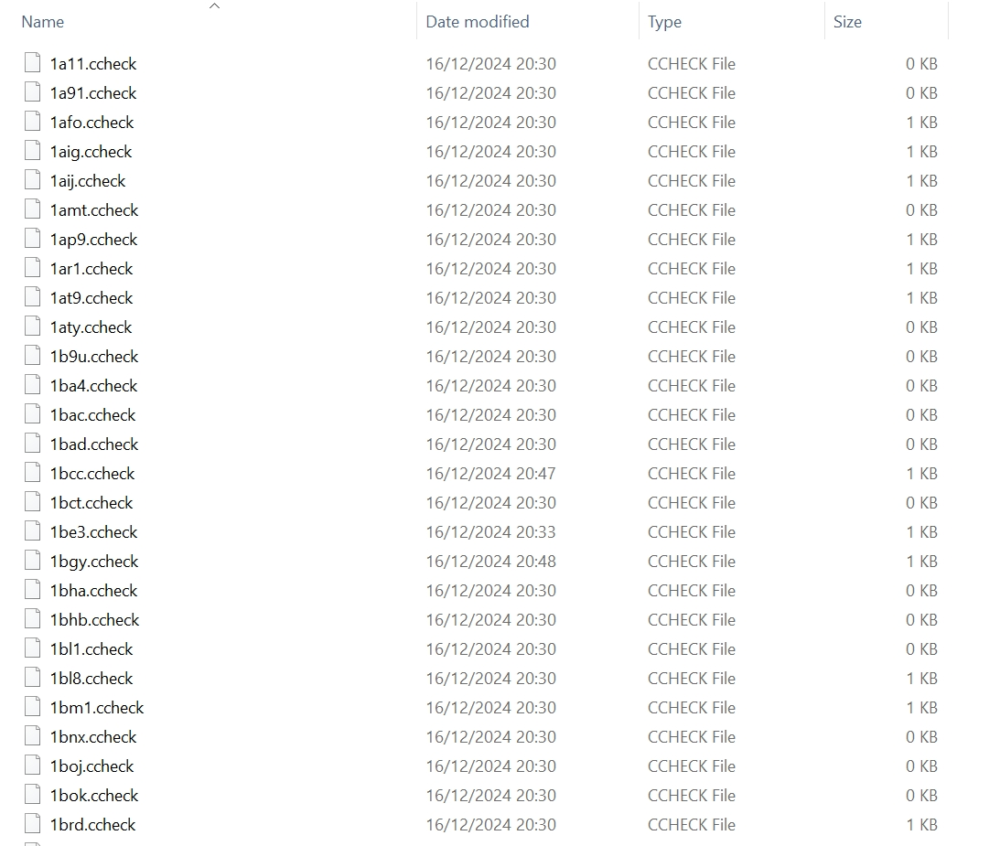{ width="600" }
  <figcaption><strong>Fig</strong>. Files for checking if chains in a complex are in interaction</figcaption>
</figure>

Then, we can merge them all as a `merge.txt` file for easily accessing the information.

:material-language-python: Python
``` py linenums="1"
df = pp.io.find_from_folder(
    file_path='data/ccheck/',
    suffix='.ccheck',
    flag=1,
    sv_fpn=None,
    # sv_fpn=to('data/find.txt'),
)
print(df)
df_c = pd.DataFrame()
for i, file_i in enumerate(df[0].values):
    try:
        tt = pp.io.read(
            df_fpn='data/ccheck/' + str(file_i) + '.ccheck',
            df_sep='\t',
            header=None,
        )
        df_c = pd.concat([df_c, tt], axis=0).reset_index(drop=True)
    except:
        continue
print(df_c)
pp.io.write(
    df=df_c,
    sv_fpn='data/ccheck/merge.txt',
    df_sep='\t',
)
```

After this, we can get the overlap of both the proteins screen from QC analysis and the proteins that are in interaction. We can do the following. Then save it as `dataset_post_ccheck.xlsx`.

:material-language-python: Python
``` py linenums="1"
df_dataset = pp.io.read(
    df_fpn='data/qc/dataset.xlsx',
    df_sep='\t',
    header=0,
    kind='excel',
)
df_ccheck = pp.io.read(df_fpn='data/ccheck/merge.txt', header=None)
df_ccheck['prot_mark'] = df_ccheck.apply(lambda x: x[0] + x[1], axis=1)
print(df_ccheck)
df = df_dataset.merge(
    df_ccheck,
    on=['prot_mark'],
)
print(df)
df = df.drop_duplicates(subset=['prot_mark'])
pp.io.write(
    df=df,
    sv_fpn='data/qc/dataset_post_ccheck.xlsx',
    df_sep='\t',
    header=True,
    kind='excel',
)
print(df)
```

<figure markdown="span">
  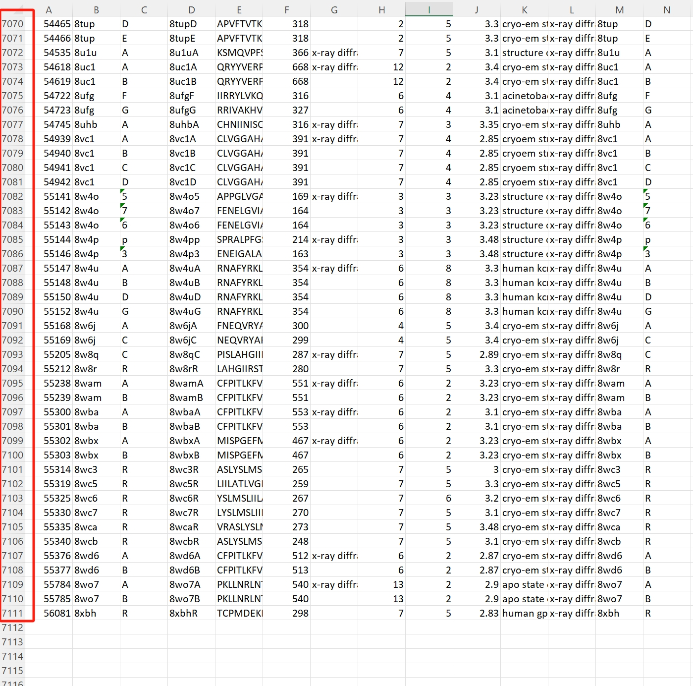{ width="600" }
  <figcaption><strong>Fig</strong>. Final dataset after confirming whether they are in interaction</figcaption>
</figure>

Now, you have the dataset for machine learning!

## 2. Feature extraction

We can start feature extraction for these protein chains. But for better illustration, we only take two example protein chains, that is, protein `1xqf` chain `A` (for training a machine learning model) and protein `1aij` chain `L` (for testing the model).

First, we can generate the label `y`.

Calculate the distance first.

:material-language-python: Python
``` py linenums="1"
pp.dist.complex_calc_all(
    pdb_fp='data/pdbtm/cplx/',
    prot_name='1aij',
    prot_chain='L',
    method='heavy',
    sv_fp='data/dist/',
)
pp.dist.complex_calc_all(
    pdb_fp='data/pdbtm/cplx/',
    prot_name='1xqf',
    prot_chain='A',
    method='heavy',
    sv_fp='data/dist/',
)
```

<figure markdown="span">
  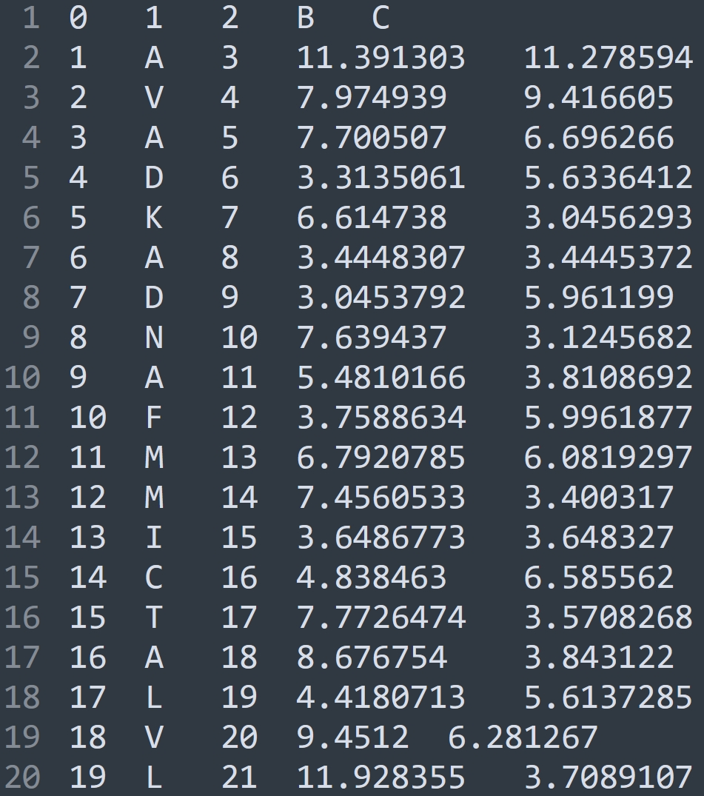{ width="300" }
  <figcaption><strong>Fig</strong>. Distance of amino acids in `1xqfA`</figcaption>
</figure>

Labelling them according to the distance then.

:material-language-python: Python
``` py linenums="1"
df_train = pp.dist.labelling(
    dist_fp='data/dist/',
    prot_name='1xqf',
    file_chain='A',
    cutoff=5.5,
)
print(df_train)
df_test = pp.dist.labelling(
    dist_fp='data/dist/',
    prot_name='1aij',
    file_chain='L',
    cutoff=5.5,
)
print(df_test)
```

`is_contact` shows the label of each amino acid site.

:material-note-multiple-outline: Output
``` text
19/12/2024 15:58:15 logger: ================>Labeling data...
19/12/2024 15:58:15 logger: ================>Time to label distances 1xqf A: 0.006977558135986328s.
     fasta_id aa  pdb_id     dist_1     dist_2  is_contact
0           1  A       3  11.391303  11.278594           0
1           2  V       4   7.974939   9.416605           0
2           3  A       5   7.700507   6.696266           0
3           4  D       6   3.313506   5.633641           1
4           5  K       7   6.614738   3.045629           1
..        ... ..     ...        ...        ...         ...
357       358  G     382  35.826157  13.476321           0
358       359  L     383  32.409570  14.432422           0
359       360  R     384  32.183815  14.324697           0
360       361  V     385  28.519402  10.922935           0
361       362  P     386  32.594830  10.024420           0

[362 rows x 6 columns]
19/12/2024 15:58:15 logger: ================>Labeling data...
19/12/2024 15:58:15 logger: ================>Time to label distances 1aij L: 0.0030066967010498047s.
     fasta_id aa  pdb_id    dist_1     dist_2  is_contact
0           1  A       1  3.359507   3.820152           1
1           2  L       2  4.832898   2.840869           1
2           3  L       3  3.621853   3.450767           1
3           4  S       4  6.046180   2.841488           1
4           5  F       5  3.438960   3.688982           1
..        ... ..     ...       ...        ...         ...
276       277  G     277  2.910155  43.177975           1
277       278  G     278  3.036153  40.448544           1
278       279  I     279  2.979592  36.381110           1
279       280  N     280  2.980944  38.922234           1
280       281  G     281  3.484761  42.785560           1

[281 rows x 6 columns]
```

To generate `X`, we extract features for the two proteins. But for demenstration here, we only involve amino acid properties in this process. There are 23 properties available to use, including

:material-language-python: Python
``` py linenums="1"
property = [
    "positive",
    "negative",
    "charged",
    "polar",
    "aliphatic",
    "aromatic",
    "hydrophobic",
    "small",
    "active",
    "weight",
    "pI",
    "solubility",
    "tm",
    "pka",
    "pkb",
    "hydrophilicity",
    "hydrophobicity",
    "fet",
    "hydration",
    "signal",
    "volume",
    "polarity",
    "composition",
]
```

Then, we mainly use the `TMKit` tool to generate these features.

:material-language-python: Python
``` py linenums="1"
seq_train = tmk.seq.read_from_fasta(
    fasta_fpn='./data/fasta/1xqfA.fasta'
)
# print(seq_train)
seq_test = tmk.seq.read_from_fasta(
    fasta_fpn='./data/fasta/1aijL.fasta'
)
# print(seq_test)
pos_list_train = tmk.seq.pos_list_single(
    len_seq=len(seq_train),
    seq_sep_superior=None,
    seq_sep_inferior=0,
)
# print(pos_list_train)
pos_list_test = tmk.seq.pos_list_single(
    len_seq=len(seq_test),
    seq_sep_superior=None,
    seq_sep_inferior=0,
)
# print(pos_list_test)

pos_train = tmk.seq.pos_single(sequence=seq_train, pos_list=pos_list_train)
# print(pos_train)
pos_test = tmk.seq.pos_single(sequence=seq_test, pos_list=pos_list_test)
# print(pos_test)

X_train = [[] for i in range(len(pos_train))]
X_test = [[] for i in range(len(pos_test))]

for i, pos in enumerate(pos_train):
    for prop in property:
        X_train[i].append(pp.fpsite.property(prop_kind=prop)[pos[1]])
for i, pos in enumerate(pos_test):
    for prop in property:
        X_test[i].append(pp.fpsite.property(prop_kind=prop)[pos[1]])
        # print(pos)
```

Let's now check `X` and `y`

:material-language-python: Python
``` py linenums="1"
import numpy as np
X_train = np.array(X_train)
X_test = np.array(X_test)
y_train = df_train['is_contact'].values
y_test = df_test['is_contact'].values
print(X_train)
print(X_test)
print(y_train)
print(y_test)
```

:material-note-multiple-outline: Output
``` text
[[1.         1.         1.         ... 0.16766467 0.39506173 0.        ]
 [1.         1.         1.         ... 0.48502994 0.12345679 0.        ]
 [1.         1.         1.         ... 0.16766467 0.39506173 0.        ]
 ...
 [0.         1.         0.33333333 ... 0.7245509  0.69135802 0.23636364]
 [1.         1.         1.         ... 0.48502994 0.12345679 0.        ]
 [1.         1.         1.         ... 0.17664671 0.38271605 0.14181818]]
[[1.         1.         1.         ... 0.16766467 0.39506173 0.        ]
 [1.         1.         1.         ... 0.64670659 0.         0.        ]
 [1.         1.         1.         ... 0.64670659 0.         0.        ]
 ...
 [1.         1.         1.         ... 0.64670659 0.03703704 0.        ]
 [1.         1.         1.         ... 0.31736527 0.82716049 0.48363636]
 [1.         1.         1.         ... 0.         0.50617284 0.26909091]]
[0 0 0 1 1 1 1 1 1 1 0 ... 0 0 0 0 0 0 0 0]
[1 1 1 1 1 1 1 1 1 1 1 ... 1 1 1 1 1 1 1 1]
```


## 3. Machine learning with random forest

Then, we can train a machine learning model by using random forest algorithms. We can draw upon the use of `sklearn` library.

:material-language-python: Python
``` py linenums="1"
from sklearn.ensemble import RandomForestClassifier
clf = RandomForestClassifier(n_estimators=100)
clf.fit(X_train, y_train)
y_pred = clf.predict(X_test)
# print(y_pred)
y_prob = clf.predict_proba(X_test)
from sklearn import metrics
print("Accuracy:", metrics.accuracy_score(y_test, y_pred))
```

:material-note-multiple-outline: Output
``` text
Accuracy:  0.5765124555160143
```

## 4. Machine learning evaluation metrics

Before post-processing and post-analysing the machine learning data, we need to save the prediction probabilities in `tma300` formats, having 1st column as amino acid positions, 2nd column as amino acid symbols, and 3rd column as prediction probabilities. 

:material-language-python: Python
``` py linenums="1"
df = pd.DataFrame(pos_test)
df = df[[0, 1]]
df[2] = y_prob[:, 0].tolist()
pp.io.write(df=df, sv_fpn='data/isite/1aijL.tma300')
```

Then, batch generating comprehensive sets of evaluation metrics.

:material-language-python: Python
``` py linenums="1"
pp.eval.sitewise_segment(
    prot_df=pd.DataFrame({
        'prot': ['1aij', ],
        'chain': ['L', ],
    }),
    dist_fp='data/dist/',
    dist_limit=5.5,
    tool_fp='data/isite/',
    tool='tma300',
    pdb_fp='data/pdb/',
    topo_fp='data/isite/',
    xml_fp='data/xml/',
    fasta_fp='data/fasta/',
    segment='phobius_tmh',
    sort=1,
    sv_fp='data/isite/',
)
```

!!! warning

    We made the evaluation in transmembrane areas predicted by Phobius. Then, we need to put this file in `topo_fp='data/isite/'`. This file can be downloaded from the [PyPropel](https://github.com/2003100127/pypropel) repository through the `release` tab.

Then, we will see a lot of files of evaluation metrics there.

<figure markdown="span">
  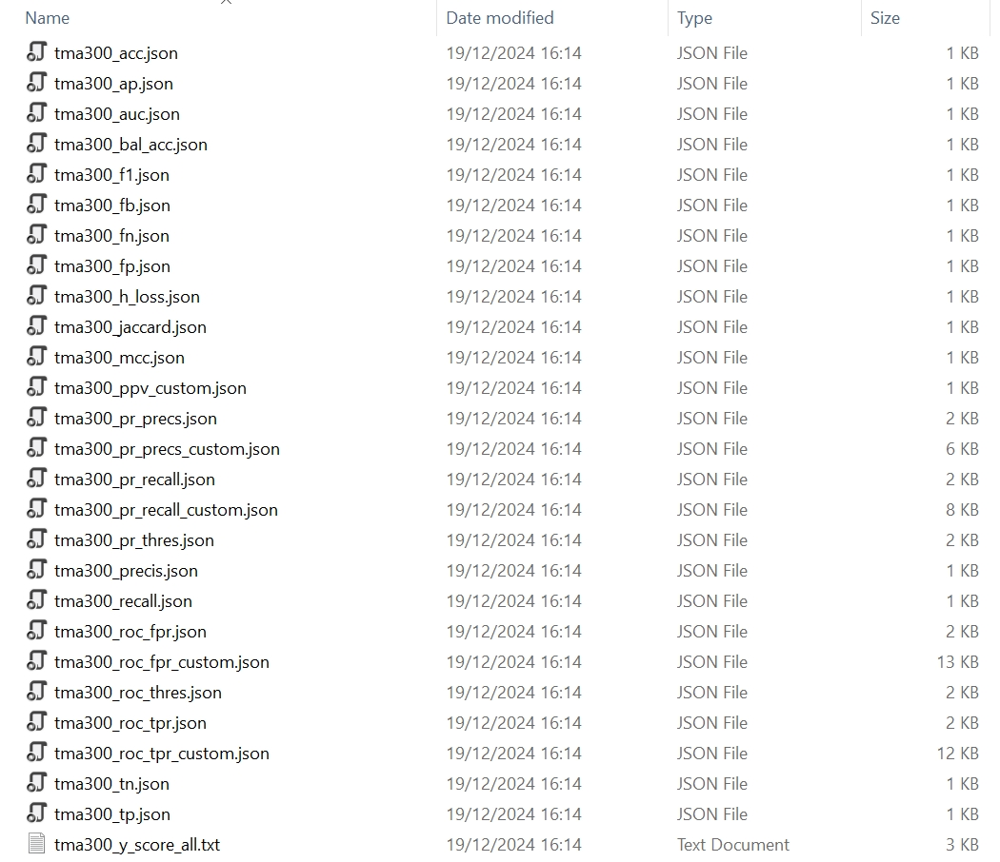{ width="300" }
  <figcaption><strong>Fig</strong>. Files of evaluation metrics</figcaption>
</figure>

The metrics are tabulated in JSON formats.

<figure markdown="span">
  { width="300" }
  <figcaption><strong>Fig</strong>. True positives</figcaption>
</figure>


## 5. Visualisation of evaluation metrics

Finally, we can plot the evaluation metrics using PyPropel. For example, the ROC curves.

:material-language-python: Python
``` py linenums="1"
X_fpns = {
    'tma300': 'data/isite/tma300_roc_fpr_custom.json',
}
Y_fpns = {
    'tma300': 'data/isite/tma300_roc_tpr_custom.json',
}
import matplotlib.pyplot as plt
fig, ax = plt.subplots(
    nrows=2,
    ncols=2,
    # figsize=(6, 5),
    figsize=(12, 10),
    sharey='all',
    sharex=False,
)
pp.plot.rocpr(
    X_fpns,
    Y_fpns,
    x_label='fpr',
    y_label='tpr',
    title='',
    ax=ax[0, 0],
)
pp.plot.rocpr(
    X_fpns,
    Y_fpns,
    x_label='fpr',
    y_label='tpr',
    title='',
    ax=ax[0, 1],
)
pp.plot.rocpr(
    X_fpns,
    Y_fpns,
    x_label='fpr',
    y_label='tpr',
    title='',
    ax=ax[1, 0],
)
plt.show()
```

<figure markdown="span">
  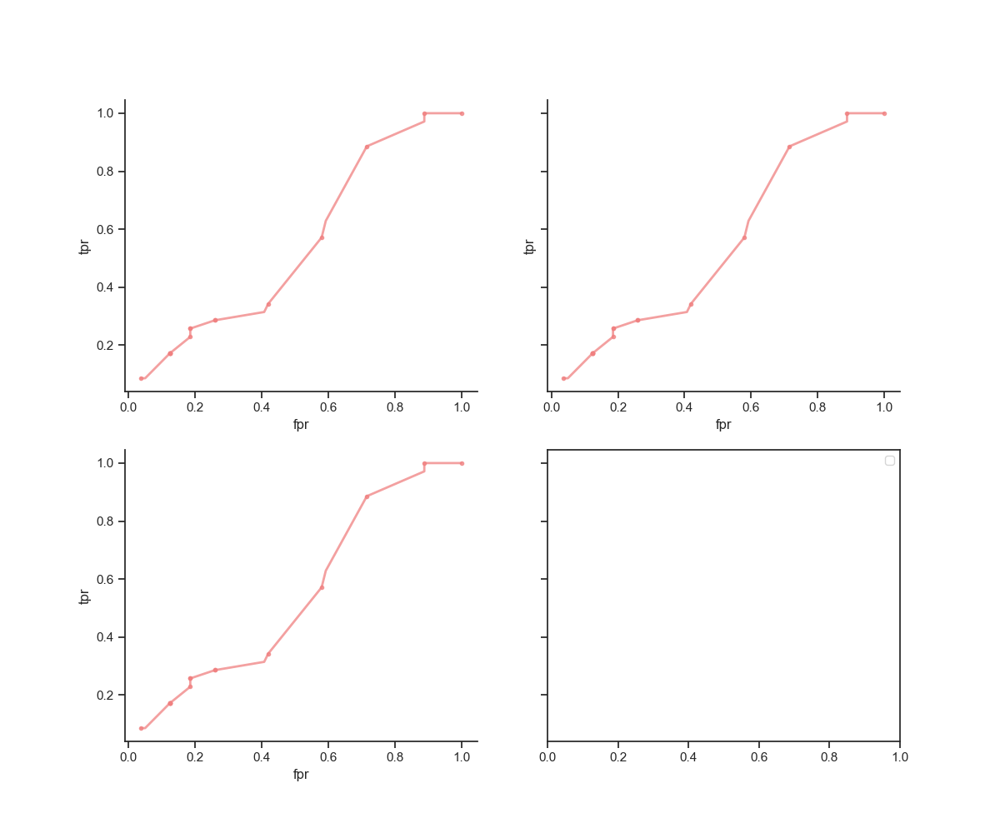{ width="600" }
  <figcaption><strong>Fig</strong>. ROC curve</figcaption>
</figure>
