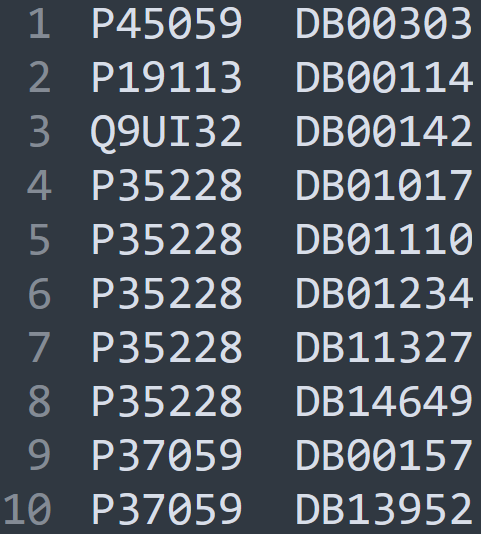

In [this review](https://doi.org/10.1016/j.ejmech.2023.115500), we supplid a deep learning method, Drutai, for sequence-based drug discovery. It uses a dataset of **drug target interactions (DTIs)** downloaded from DrugBank with a version: 5.1.8. The proteins are from human. Now, we show an example of whether we could use **PyPropel** together with other tools to quickly train a machine learning model for **predicting DTIs specific to human transmembrane proteins**.

We walk you through a detailed, hands-on tutorial in achieving this purpose. First, we download the human transmembrane proteins from UniProt. Second, we download the DTIs from DrugBank. The data can be fetched from the [PyPropel](https://github.com/2003100127/pypropel) repository through the `release` tab, where the training and test datasets of Drutai can also be found.

!!! abstract Idea

    The key idea is to get the portion of Drutai's training and test proteins overlapped with the transmenbrane proteome. Using them, we demonstrate how to train a new predictor. Importantly, the idea can be supported step-by-step by PyPropel because the combination of a few APIs can achieve it.

You will specifically see how **PyPropel** and **TMKit** can batch pre-process the structures of 10,971 protein complexes files (including structures of 58,060 protein chains). Finally, we will put the generated data for machine learning using **scikit-learn**.

It includes 4 procedures:

!!! tip "Features"

    * :material-package-variant: Data preparation
    * :material-pencil-box-multiple-outline: Generation of training and test datasets
    * :fontawesome-solid-code-pull-request: Feature extraction
    * :fontawesome-solid-code-pull-request: Machine learning with random forest


Let's first import both of the libraries.

:material-language-python: Python
``` py linenums="1"
import pypropel as pp
import tmkit as tmk
```

Additionally, we will also use **NumPy** and **Pandas** for quickly processing data.

:material-language-python: Python
``` py linenums="1"
import numpy as np
import pandas as pd
```

## 1. Data preparation

First, we need to split the transmembrane proteome into separate Fasta files to gain the sequences and identifiers of proteins.

:material-language-python: Python
``` py linenums="1"
df, df_new = pp.convert.many2single(
    fasta_fpn='data/dti/uniprotkb_KW_0812_AND_reviewed_true_AND_2024_12_08.fasta',
    mode='uniprot',
    species='HUMAN',
    sv_fp='data/dti/transmembrane/',
)
```

Similarly, we split the entire protein set (`approved.fasta`) into individual protein files.

!!! info

    Due to different formats of the headers in Fasta files between UniProt and DrugBank, we need to specify `mode='uniprot'` or `mode='drugbank'` there to tell **PyPropel** to take action to tailor these formats. 


:material-language-python: Python
``` py linenums="1"
df, df_new = pp.convert.many2single(
    fasta_fpn='data/dti/approved.fasta',
    mode='drugbank',
    species='',
    sv_fp='data/dti/drugbank/',
)
```

!!! warning

    Becasue the training set of proteins in Drutai contains the portion of proteins categorised into `experimental` by DrugBank, we will need to also extract the entire proteins from `expt.fasta`.

We can obtain the identifiers of all UniProt's and DrugBank's transmembrane proteins this way.

:material-language-python: Python
``` py linenums="1"
df_tm = pp.io.find_from_folder(
    file_path='data/dti/transmembrane/',
    suffix='.fasta',
    flag=1,
    sv_fpn=None,
    # sv_fpn=to('data/find.txt'),
)
print(df_tm)

df_drugbank = pp.io.find_from_folder(
    file_path='data/dti/drugbank/',
    suffix='.fasta',
    flag=1,
    sv_fpn=None,
    # sv_fpn=to('data/find.txt'),
)
print(df_drugbank)
```

We can gain an understanding of the quantity of drug targets that are overlapped with transmembrane proteome. 

:material-language-python: Python
``` py linenums="1"
df_drugbank_tm = df_drugbank.loc[df_drugbank[0].isin(df_tm[0].values)]
print(df_drugbank_tm)
```

Download training and test sets of Drutai from PyPropel's Github repository. They are

1. `train_pl.txt.txt`
2. `train_nl.txt`
3. `positive_test.txt`
4. `negative_test.txt`

For example, DTIs are arranged in the `train_pl.txt.txt` file as below.

<figure markdown="span">
  { width="200" }
  <figcaption><strong>Fig</strong>. DTIs</figcaption>
</figure>

## 2. Generation of training and test datasets

We can build the training set of proteins.

:material-language-python: Python
``` py linenums="1"
df_ptrain = pp.io.read(
    df_fpn='data/dti/train_pl.txt'
)
df_ntrain = pp.io.read(
    df_fpn='data/dti/train_nl.txt'
)
print(df_ptrain)
print(df_ntrain)
df_ptrain_tm = df_ptrain.loc[df_ptrain[0].isin(df_tm[0].values)]
df_ntrain_tm = df_ntrain.loc[df_ntrain[0].isin(df_tm[0].values)]
df_ptrain_tm[2] = 1
df_ntrain_tm[2] = 0
print(df_ptrain_tm)
print(df_ntrain_tm)
df_train = (pd.concat([df_ptrain_tm, df_ntrain_tm], axis=0).reset_index(drop=True))
```

We can build the test set of proteins.

:material-language-python: Python
``` py linenums="1"
df_ptest = pp.io.read(
    df_fpn='data/dti/positive_test.txt'
)
df_ntest = pp.io.read(
    df_fpn='data/dti/negative_test.txt'
)
# print(df_ptest)
# print(df_ntest)

df_ptest_tm = df_ptest.loc[df_ptest[0].isin(df_tm[0].values)]
df_ntest_tm = df_ntest.loc[df_ntest[0].isin(df_tm[0].values)]
df_ptest_tm[2] = 1
df_ntest_tm[2] = 0
# print(df_ptest_tm)
# print(df_ntest_tm)
```

It is important to shuffle the training dataset to ensure randomness for better machine learning.

:material-language-python: Python
``` py linenums="1"
df_train = df_train.iloc[np.random.RandomState(1).permutation(df_train.shape[0])].reset_index(drop=True)
```

## 3. Feature extraction

Let's now engineer a set of protein and chemical features into a `X` matrix for machine learning.

To gain chemical features, we use the `RDKit` tool (please ensure that it has been installed in your conda environment before use). The `all.sdf` contains the structures of all molecules downloaded from DrugBank (version: 5.1.8). We store them in a dictionary `mols` for easily accessing them whenever use.

:material-language-python: Python
``` py linenums="1"
from rdkit import Chem
from rdkit.Chem import Crippen
all_mols = Chem.SDMolSupplier('data/dti/all.sdf')
mols = dict()
for mol in all_mols:
    if mol:
        mols[mol.GetProp('DATABASE_ID')] = mol
```

We set a for loop to obtain each pair of a protein and a drug molecule each time.

!!! info

    The protein features include: AAC, DAC, TAC, CKSNAP, and AVEANF. The usage of all of them are shown in the documentation of PyPropel. 

We can first use protein features of AAC, DAC, and AVEANF only to gain the first sight on what the prediction performance looks like, as below.

:material-language-python: Python
``` py linenums="1"
X = [[] for _ in range(df_train.shape[0])]
for i in range(df_train.shape[0]):
    print('pair {}: {} {}'.format(i, df_train[0][i], df_train[1][i]))
    sequence = tmk.seq.read_from_fasta(fasta_fpn='data/dti/drugbank/' + str(df_train[0][i]) + '.fasta')
    # print(sequence)
    # ### #/*** block AAC (20) ***/
    aac = pp.fpseq.composition(
        seq=sequence,
        mode='aac',
    )
    aac_ = [*aac.values()]
    aac_ = [np.float32(i) for i in aac_]    
    for j in range(20):
        X[i].append(aac_[j])

    # ### #/*** block DAC (400) ***/
    dac = pp.fpseq.composition(
        seq=sequence,
        mode='dac',
    )
    for j in range(400):
        X[i].append(np.float32(dac[j][1]))

    # ### #/*** block TAC (8000) ***/
    # tac = pp.fpseq.composition(
    #     seq=sequence,
    #     mode='tac',
    # )
    # for j in range(8000):
    #     X[i].append(np.float32(tac[j][1]))

    # cksnap = pp.fpseq.composition(
    #     seq=sequence,
    #     mode='cksnap',
    # )
    # cksnap_ = [*cksnap.values()]
    # cksnap_ = [np.float32(i) for i in cksnap_]
    # for j in range(400):
    #     X[i].append(cksnap_[j])

    aveanf = pp.fpseq.composition(
        seq=sequence,
        mode='aveanf',
    )
    aveanf_ = [*aveanf.values()]
    aveanf_ = [np.float32(i) for i in aveanf_]
    for j in range(20):
        X[i].append(aveanf_[j])

    mol_name = df_train[1][i]

    # LogP = Crippen.MolLogP(mols[mol_name])
    # molar_refractivity = Crippen.MolMR(mols[mol_name])
    # lm = np.array([LogP, molar_refractivity])
    # # print(lm)
    # for _, v in enumerate(lm):
    #     X[i].append(np.float32(v))
```

In addition, during the feature extraction, the way we put features in can be equivalently used in putting features generated by other tools, for example, [PyProtein](https://pybiomed.readthedocs.io/en/latest/index.html).

:material-language-python: Python
``` py linenums="1"
 # ### #/*** block CTD (147) ***/
# ctd_ = PyProtein.PyProtein(sequence).GetCTD()
# ctd_values = ctd_.values()
# for val in ctd_values:
#     features[i].append(np.float32(val))
```

In the training set, we have 9426 DTIs in total. We can train the first 8000 DTIs and take the rest of them for validation of machine learning performance.

:material-language-python: Python
``` py linenums="1"
y = df_train[2].values

X_train = X[:8000]
X_test = X[8000:]
y_train = y[:8000]
y_test = y[8000:]
```

:material-note-multiple-outline: Output
``` text
[[ 7.3016003e-02  2.8571000e-02  2.8571000e-02 ...  5.0414350e-02
   3.5518999e+00  1.3252400e+02]
 [ 4.2826999e-02  2.5696000e-02  5.3532999e-02 ...  4.4115603e-02
  -1.4215300e+00  8.4962303e+01]
 [ 5.9880000e-02  5.9880000e-03  5.3892002e-02 ...  3.6085926e-02
  -2.1226001e+00  2.7285200e+01]
 ...
 [ 1.5277800e-01  2.1825001e-02  3.7698001e-02 ...  3.0565832e-02
  -3.4000000e-01  1.8316799e+01]
 [ 9.7156003e-02  3.3174999e-02  3.7914999e-02 ...  3.1797495e-02
   3.3736999e+00  1.1967500e+02]
 [ 8.2608998e-02  3.2609001e-02  2.1739000e-02 ...  3.8699895e-02
   3.8090000e+00  1.1576270e+02]]
(9426, 442)
```


## 4. Machine learning with random forest

### 3.1 training a random forest model

:material-language-python: Python
``` py linenums="1"
from sklearn.ensemble import RandomForestClassifier
clf = RandomForestClassifier(n_estimators=100)
clf.fit(X_train, y_train)
```

### 3.2 evaluation

:material-language-python: Python
``` py linenums="1"
y_pred = clf.predict(X_test)
print(y_pred)
from sklearn import metrics
print("Aaccuracy: ", metrics.accuracy_score(y_test, y_pred))
```

If we use protein features only, the aaccuracy is

:material-note-multiple-outline: Output
``` text
Aaccuracy: 0.7349228611500701
```

If we further add chemical features of LogP and molar refractivity of drug molecules, the aaccuracy becomes

:material-note-multiple-outline: Output
``` text
Aaccuracy: 0.7496493688639552
```

We can see the extra introduction of some features, prediction performance gets boosted.

