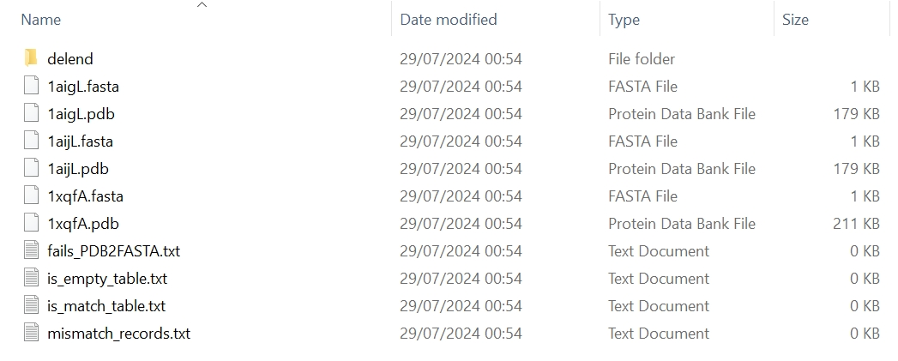

We can generate a dataset of protein structures, XML, and sequences simutaneously using `pp.dataset.download_pack`.

!!! warning

    `pdb_cplx_fp` must be use to direct `pp.dataset.download_pack` to a directory where protein complex structures are stored.


:material-language-python: Python
``` py linenums="1"
import pypropel as pp

pp.dataset.download_pack(
    prot_df=prot_df,
    pdb_cplx_fp=to('data/pdb/complex/pdbtm/'),
    pdb_fp=to('data/tmp/'),
    xml_fp=to('data/tmp/'),
    fasta_fp=to('data/tmp/'),
)
```

:material-note-multiple-outline: Output
``` text
29/07/2024 00:54:14 logger: =========>++++++++++++++++++++split into chains...
+++++++++++++++++++++++++++
29/07/2024 00:54:14 logger: ============>No0. protein 1aig chain L
D:\Programming\anaconda3\envs\prot\Lib\site-packages\Bio\PDB\Atom.py:232: PDBConstructionWarning: Could not assign element 'M' for Atom (name=MG) with given element 'M'
  warnings.warn(msg, PDBConstructionWarning)
29/07/2024 00:54:14 logger: ================>success in building 1aigL model.
29/07/2024 00:54:14 logger: ============>No1. protein 1aij chain L
D:\Programming\anaconda3\envs\prot\Lib\site-packages\Bio\PDB\Atom.py:232: PDBConstructionWarning: Could not assign element 'M' for Atom (name=MG) with given element 'M'
  warnings.warn(msg, PDBConstructionWarning)
29/07/2024 00:54:14 logger: ================>success in building 1aijL model.
29/07/2024 00:54:14 logger: ============>No2. protein 1xqf chain A
29/07/2024 00:54:14 logger: ================>success in building 1xqfA model.
29/07/2024 00:54:14 logger: =========>++++++++++++++++++++delete END from PDB files...
+++++++++++++++++++++++++++
29/07/2024 00:54:14 logger: ============>No0. protein 1aig chain L
29/07/2024 00:54:14 logger: ===============>Successfully reformatted
29/07/2024 00:54:14 logger: ============>No1. protein 1aij chain L
29/07/2024 00:54:14 logger: ===============>Successfully reformatted
29/07/2024 00:54:14 logger: ============>No2. protein 1xqf chain A
29/07/2024 00:54:14 logger: ===============>Successfully reformatted
29/07/2024 00:54:14 logger: =========>++++++++++++++++++++remove hetatm from PDB files...
+++++++++++++++++++++++++++
29/07/2024 00:54:14 logger: ============>No.1 protein 1aig chain L
29/07/2024 00:54:14 logger: ============>No.2 protein 1aij chain L
29/07/2024 00:54:14 logger: ============>No.3 protein 1xqf chain A
29/07/2024 00:54:14 logger: =========>++++++++++++++++++++is match...
+++++++++++++++++++++++++++
29/07/2024 00:54:14 logger: ============>No0. protein 1aig chain L
29/07/2024 00:54:14 logger: ============>File does not exist
29/07/2024 00:54:14 logger: ============>No1. protein 1aij chain L
29/07/2024 00:54:14 logger: ============>File does not exist
29/07/2024 00:54:14 logger: ============>No2. protein 1xqf chain A
29/07/2024 00:54:14 logger: ============>File does not exist
29/07/2024 00:54:14 logger: =========>++++++++++++++++++++to Fasta...
+++++++++++++++++++++++++++
29/07/2024 00:54:14 logger: ============>No0. protein 1aig chain L
29/07/2024 00:54:14 logger: ===============>successfully converted
29/07/2024 00:54:14 logger: ============>No1. protein 1aij chain L
29/07/2024 00:54:14 logger: ===============>successfully converted
29/07/2024 00:54:14 logger: ============>No2. protein 1xqf chain A
29/07/2024 00:54:14 logger: ===============>successfully converted
29/07/2024 00:54:14 logger: =========>++++++++++++++++++++is empty...
+++++++++++++++++++++++++++
29/07/2024 00:54:14 logger: ============>No0. protein 1aig chain L
29/07/2024 00:54:14 logger: ============>No1. protein 1aij chain L
29/07/2024 00:54:14 logger: ============>No2. protein 1xqf chain A
Finished
```


Then, we can see all downloaded structure, XML, and sequence files there.

<figure markdown="span">
  { width="800" }
  <figcaption><strong>Fig</strong> 1. Downloaded dataset</figcaption>
</figure>