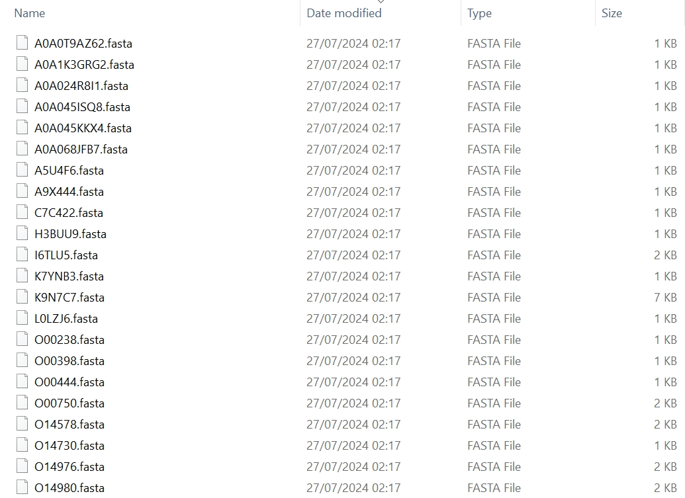

## 1. Combining single proteins into one

1.1 Command

``` py linenums="1"
import pypropel as pp

df = pp.convert.single2many(
    fasta_fp=to('data/fasta/'),
    prot_df=pd.DataFrame({
        'prot': ['1aig', '1aij', '1xqf'],
        'chain': ['L', 'L', 'A'],
    }),
    sv_fpn=to('data/fasta/s2m.fasta')
)
```

1.2 Results

=== "Output"

    ``` shell
    >1aigL
    ALLSFERKYRVPGGTLVGGNLFDFWVGPFYVGFFGVATFFFAALGIILIAWSAVLQGTWNPQLISVYPPALEYGLGGAPLAKGGLWQIITICATGAFVSWALREVEICRKLGIGYHIPFAFAFAILAYLTLVLFRPVMMGAWGYAFPYGIWTHLDWVSNTGYTYGNFHYNPAHMIAISFFFTNALALALHGALVLSAANPEKGKEMRTPDHEDTFFRDLVGYSIGTLGIHRLGLLLSLSAVFFSALCMIITGTIWFDQWVDWWQWWVKLPWWANIPGGING
    >1aijL
    ALLSFERKYRVPGGTLVGGNLFDFWVGPFYVGFFGVATFFFAALGIILIAWSAVLQGTWNPQLISVYPPALEYGLGGAPLAKGGLWQIITICATGAFVSWALREVEICRKLGIGYHIPFAFAFAILAYLTLVLFRPVMMGAWGYAFPYGIWTHLDWVSNTGYTYGNFHYNPAHMIAISFFFTNALALALHGALVLSAANPEKGKEMRTPDHEDTFFRDLVGYSIGTLGIHRLGLLLSLSAVFFSALCMIITGTIWFDQWVDWWQWWVKLPWWANIPGGING
    >1xqfA
    AVADKADNAFMMICTALVLFMTIPGIALFYGGLIRGKNVLSMLTQVTVTFALVCILWVVYGYSLAFGEGNNFFGNINWLMLKNIELTAVMGSIYQYIHVAFQGSFACITVGLIVGALAERIRFSAVLIFVVVWLTLSYIPIAHMVWGGGLLASHGALDFAGGTVVHINAAIAGLVGAYLPHNLPMVFTGTAILYIGWFGFNAGSAGTANEIAALAFVNTVVATAAAILGWIFGEWALRGKPSLLGACSGAIAGLVGVTPACGYIGVGGALIIGVVAGLAGLWGVTMPCDVFGVHGVCGIVGCIMTGIFAASSLGGVGFAEGVTMGHQLLVQLESIAITIVWSGVVAFIGYKLADLTVGLRVP
    ```

=== "Console"

    ``` py
    27/07/2024 01:36:24 logger: =========>integrate 3 protein sequences
    27/07/2024 01:36:24 logger: =========>save fasta to files
    27/07/2024 01:36:24 logger: =========>save finished
    ```


## 2. Splitting into single proteins

1.1 Proteins from DrugBank

``` py linenums="1"
import pypropel as pp

df, df_new = pp.convert.many2single(
    fasta_fpn=to('data/msa/experimental_protein.fasta'),
    sv_fp=to('data/msa/')
)
```

1.2 Fasta from UniProt
Only extract human proteins by adding species as 'HUMAN'.

``` py linenums="1"
import pypropel as pp

df, df_new = pp.convert.many2single(
    fasta_fpn=to('data/uniprotkb_KW_0812_AND_reviewed_true_AND_2024_12_08.fasta'),
    mode='uniprot',
    species='HUMAN',
    sv_fp=to('data/')
)
```

=== "Output"

    ``` shell
    There are 2888 fasta files in output directory to('data/msa/').
    ```

=== "Console"

    ``` py
        27/07/2024 02:17:26 logger: =========>content of the dataframe:
     Index(['fasta_ids', 'fasta_seqs', 'fasta_names', 'fasta_dpts', 'target_ids',
           'drug_ids'],
          dtype='object')
    27/07/2024 02:17:26 logger: =========>target IDs:
     0       P45059
    1       P19113
    2       Q9UI32
    3       P00488
    4       P35228
             ...  
    3272    P07766
    3273    P09693
    3274    P20963
    3275    P03420
    3276    P11209
    Name: target_ids, Length: 3277, dtype: object
    27/07/2024 02:17:26 logger: =========>start to split into single fasta files
    27/07/2024 02:17:26 logger: =========># of proteins: 3277
    27/07/2024 02:17:26 logger: =========># of proteins after deduplication: 2888
    ```


<figure markdown="span">
  { width="800" }
  <figcaption><strong>Fig</strong> 1. Converted Fasta files</figcaption>
</figure>


## 3. Extract sequences from MSA

`pp.convert.msa2fas` can extract each homolog from a MSA to write in Fasta format.

:material-language-python: Python
``` py linenums="1"
import pypropel as pp

pp.convert.msa2fas(
    input_fpn=to('data/msa/a2m/ET.a2m'),
    output_fp=to('data/msa/a2m/'),
)
```

:material-note-multiple-outline: Output
``` text
28/07/2024 09:37:52 logger: =========>extract E to save
28/07/2024 09:37:52 logger: =========>extract UR100_A0A023PSW1 to save
28/07/2024 09:37:52 logger: =========>extract UR100_A0A088DKU1 to save
28/07/2024 09:37:52 logger: =========>extract UR100_A0A0K1Z002 to save
...
28/07/2024 09:37:52 logger: =========>extract UR100_U3M734 to save
28/07/2024 09:37:52 logger: =========>extract UR100_V5N926 to save
'Finished'
```

## 4. Convert bewteen MSA formats

`pp.convert.msa_reformat` can convert a MSA from one to another format, e.g., from fasta format to stockholm format.

:material-language-python: Python
``` py linenums="1"
import pypropel as pp

pp.convert.msa_reformat(
    input_fpn=to('data/msa/a2m/ET.a2m'),
    in_format='fasta',
    output_fpn=to('data/msa/a2m/ET_converted.sto'),
    out_format='stockholm',
)
```

:material-note-multiple-outline: Output
``` text
28/07/2024 09:53:30 logger: =========> convert from fasta to stockholm
'Finished'
```

## 5. Convert from PDB to FASTA

To perform this conversion, a `pp.str` module is used.

:material-language-python: Python
``` py linenums="1"
import pypropel as pp

prot_df = pd.DataFrame({
    'prot': ['1aig', '1aij', '1xqf'],
    'chain': ['L', 'L', 'A'],
})
    
pp.str.tofasta(
    prot_df,
    sv_fp=to('data/'),
    pdb_path=to('data/pdb/pdbtm/'),
)
```

:material-note-multiple-outline: Output
``` text
28/07/2024 17:00:02 logger: ============>No0. protein 1aig chain L
D:\Programming\anaconda3\envs\prot\Lib\site-packages\Bio\PDB\PDBParser.py:395: PDBConstructionWarning: Ignoring unrecognized record 'END' at line 2234
  warnings.warn(
28/07/2024 17:00:02 logger: ===============>successfully converted
28/07/2024 17:00:02 logger: ============>No1. protein 1aij chain L
D:\Programming\anaconda3\envs\prot\Lib\site-packages\Bio\PDB\PDBParser.py:395: PDBConstructionWarning: Ignoring unrecognized record 'END' at line 2234
  warnings.warn(
28/07/2024 17:00:02 logger: ===============>successfully converted
28/07/2024 17:00:02 logger: ============>No2. protein 1xqf chain A
D:\Programming\anaconda3\envs\prot\Lib\site-packages\Bio\PDB\PDBParser.py:395: PDBConstructionWarning: Ignoring unrecognized record 'END' at line 2634
  warnings.warn(
28/07/2024 17:00:03 logger: ===============>successfully converted
finished
```