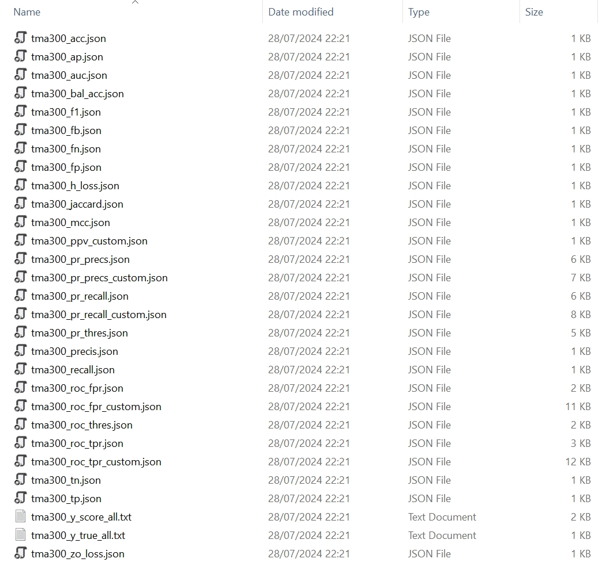

## Interaction prediction

Protein residue sites involved in interaction are functionally important for cellular activities. They are generally defined as spatially closed residues in a protein complex. It would be easiest to obtain information of interaction sites from a protein complex structure _per se_. Thus, there are plenty of literature and work carried out to develop interaction predictors. To evaluate their predictive abilities, we implemented a powerful module `pp.eval` to evaluate sitewise predictors (include but not limited to interaction predictors).

We take protein `1aij` chain `L` as an example to evaluate an interaction site predictor, `tma300` in its transmembrane segments demarked by the PDBTM database. If you are not interested in transmembrane segments, you can set `segment` to `whole`.

:material-language-python: Python
``` py linenums="1"
import pypropel as pp
import pandas as pd

prot_df = pd.DataFrame({
        'prot': ['1aij', ],
        'chain': ['L', ],
    })

pp.eval.sitewise_segment(
    prot_df=prot_df,
    dist_fp=to('data/pdb/complex/pdbtm/'),
    dist_limit=6.,
    tool_fp=to('data/isite/deeptminter/'),
    tool='tma300',
    pdb_fp=to('data/pdb/pdbtm/'),
    topo_fp=to('data/phobius/'),
    xml_fp=to('data/xml/'),
    fasta_fp=to('data/fasta/'),
    segment='pdbtm_tmh',
    sort=1,
    sv_fp=to('data/'),
)
```

:material-note-multiple-outline: Output
``` shell
28/07/2024 22:48:41 logger: ================>Labeling data...
28/07/2024 22:48:41 logger: ================>Time to label distances 1aij L: 0.00400090217590332s.
=========>Segment lower pdb id: [  1  50 106 131 150 164 190 248 259 268]
=========>Segment upper pdb id: [ 31  89 115 149 163 171 231 258 267 281]
=========>Segment lower fasta id: [1, 50, 106, 131, 150, 164, 190, 248, 259, 268]
=========>Segment upper fasta id: [31, 89, 115, 149, 163, 171, 231, 258, 267, 281]
=========>Segment lower pdb id: [ 32  90 116 172 232]
=========>Segment upper pdb id: [ 49 105 130 189 247]
=========>Segment lower fasta id: [32, 90, 116, 172, 232]
=========>Segment upper fasta id: [49, 105, 130, 189, 247]
{'1aij_L': {83: 28, 42: 25, 17: 13, 8: 7}}
```

It results in 29 files for evaluation.

<figure markdown="span">
  { width="800" }
  <figcaption><strong>Fig</strong> 1. Files of multiple evaluation metrics</figcaption>
</figure>