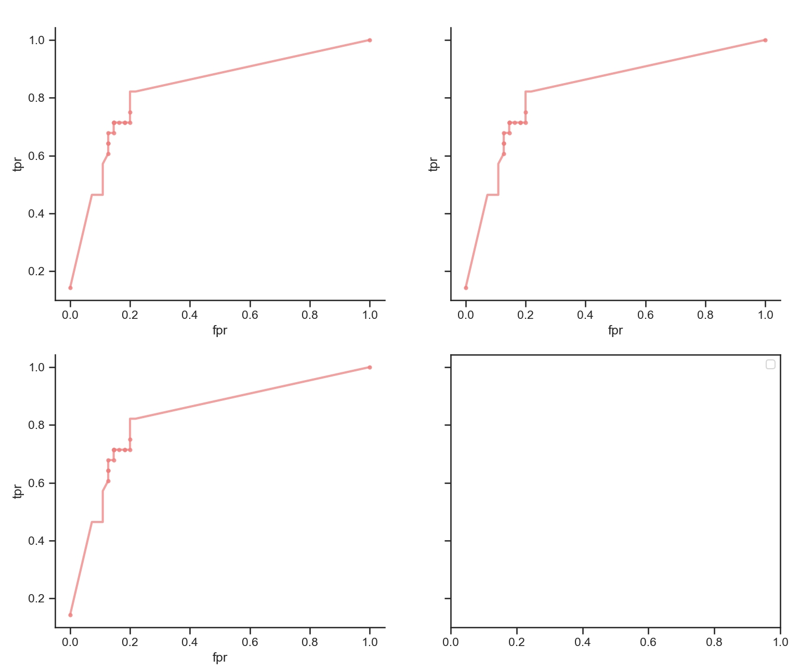

Plotting evaluation metrics, such as ROCPR, are important for understanding predictive ability. In the current version, we can use PyPropel to draw ROCPR curves.

We use interaction predicted probabilities by the `tma300` tool.

`tma300_roc_fpr_custom.json` contains false positive rate (FPR) and `tma300_roc_tpr_custom.json` contains true positive rate (TPR).

:material-language-python: Python
``` py linenums="1"
import pypropel as pp

X_fpns = {
    'tma300': to('data/eval/tma300/tma300_roc_fpr_custom.json'),
}
Y_fpns = {
    'tma300': to('data/eval/tma300/tma300_roc_tpr_custom.json'),
}

fig, ax = plt.subplots(
    nrows=2,
    ncols=2,
    # figsize=(6, 5),
    figsize=(12, 10),
    sharey='all',
    sharex=False,
)
pp.plot.rocpr(
    X_fpns,
    Y_fpns,
    x_label='fpr',
    y_label='tpr',
    title='',
    ax=ax[0, 0],
)
pp.plot.rocpr(
    X_fpns,
    Y_fpns,
    x_label='fpr',
    y_label='tpr',
    title='',
    ax=ax[0, 1],
)
pp.plot.rocpr(
    X_fpns,
    Y_fpns,
    x_label='fpr',
    y_label='tpr',
    title='',
    ax=ax[1, 0],
)
plt.show()
```


<figure markdown="span">
  { width="800" }
  <figcaption><strong>Fig</strong> 1. ROCPR curves</figcaption>
</figure>