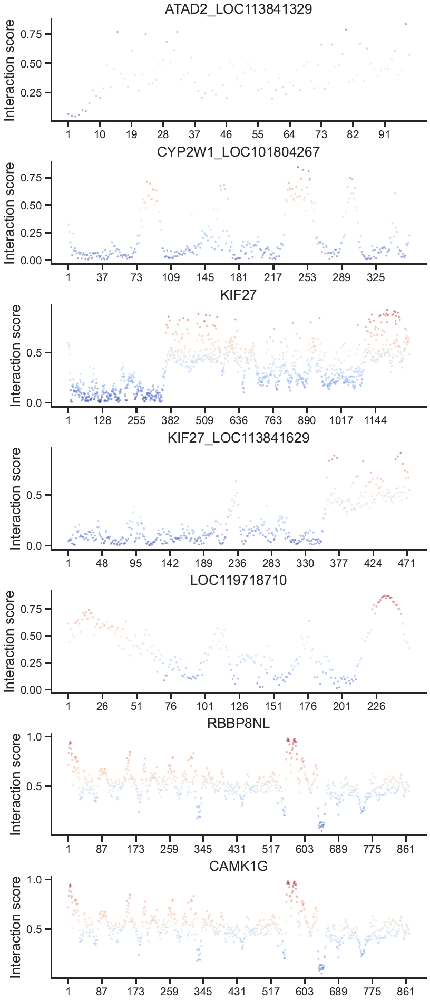
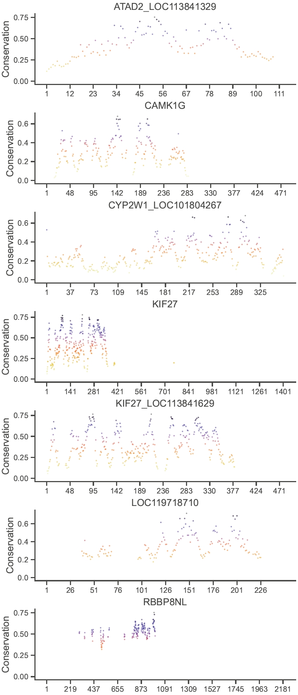
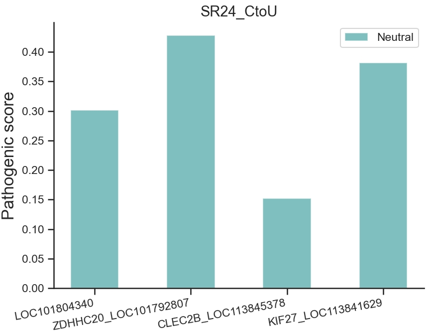

We plot the results from three tools, `GraphPPIsv2`[^1], `JSD`[^2], and `MutPred2`[^3], to understand the evolution of residues from MSAs of 7 example proteins, that is,

``` text
ATAD2_LOC113841329
CYP2W1_LOC101804267
KIF27
KIF27_LOC113841629
LOC119718710
RBBP8NL
CAMK1G
```

[^1]: Qianmu Yuan, Jianwen Chen, Huiying Zhao, Yaoqi Zhou, Yuedong Yang, Structure-aware protein–protein interaction site prediction using deep graph convolutional network, Bioinformatics, Volume 38, Issue 1, January 2022, Pages 125–132, https://doi.org/10.1093/bioinformatics/btab643

[^2]: John A. Capra, Mona Singh, Predicting functionally important residues from sequence conservation, Bioinformatics, Volume 23, Issue 15, August 2007, Pages 1875–1882, https://doi.org/10.1093/bioinformatics/btm270

[^3]: Pejaver, V., Urresti, J., Lugo-Martinez, J. et al. Inferring the molecular and phenotypic impact of amino acid variants with MutPred2. Nat Commun 11, 5918 (2020). https://doi.org/10.1038/s41467-020-19669-x

#### GraphPPIsv2

GraphPPIsv2 is used to draw the interaction profile of residues.

:material-language-python: Python
``` py linenums="1"
import pypropel as pp

pp.plot.isite(
    method='graphppis',
    isite_fpns={
        'ATAD2_LOC113841329': to('data/isite/graphppis/SR24_AtoI/ATAD2_LOC113841329.txt'),
        'CYP2W1_LOC101804267': to('data/isite/graphppis/SR24_AtoI/CYP2W1_LOC101804267.txt'),
        'KIF27': to('data/isite/graphppis/SR24_AtoI/KIF27.txt'),
        'KIF27_LOC113841629': to('data/isite/graphppis/SR24_AtoI/KIF27_LOC113841629.txt'),
        'LOC119718710': to('data/isite/graphppis/SR24_AtoI/LOC119718710.txt'),
        'RBBP8NL': to('data/isite/graphppis/SR24_AtoI/RBBP8NL.txt'),
        'CAMK1G': to('data/isite/graphppis/SR24_AtoI/RBBP8NL.txt'),
    },
    cmap='coolwarm',
    sv_fpn="./A2I_ppi.pdf",  # A2I_ppi C2U_ppi
)
```

<figure markdown="span">
  { width="500" }
  <figcaption><strong>Fig</strong> 1. Interaction profile of residues</figcaption>
</figure>


#### JSD

JSD is used to draw the conservation profile of residues.

:material-language-python: Python
``` py linenums="1"
import pypropel as pp

pp.plot.conservation(
    method='jsd',
    conser_fpns={
        'ATAD2_LOC113841329': to('data/conservation/jsd/SR24_AtoI/ATAD2_LOC113841329.jsd'),
        'CAMK1G': to('data/conservation/jsd/SR24_AtoI/CAMK1G.jsd'),
        'CYP2W1_LOC101804267': to('data/conservation/jsd/SR24_AtoI/CYP2W1_LOC101804267.jsd'),
        'KIF27': to('data/conservation/jsd/SR24_AtoI/KIF27.jsd'),
        'KIF27_LOC113841629': to('data/conservation/jsd/SR24_AtoI/KIF27_LOC113841629.jsd'),
        'LOC119718710': to('data/conservation/jsd/SR24_AtoI/LOC119718710.jsd'),
        'RBBP8NL': to('data/conservation/jsd/SR24_AtoI/RBBP8NL.jsd'),
    },
    cmap='CMRmap_r',
    sv_fpn="./A2I_conser.pdf", # A2I_conser C2U_conser
)
```

<figure markdown="span">
  { width="500" }
  <figcaption><strong>Fig</strong> 2. Conservation profile of residues</figcaption>
</figure>


#### MutPred2

MutPred2 is used to draw the mutational profile of residues.

:material-language-python: Python
``` py linenums="1"
import pypropel as pp

pp.plot.mutpred2(
    fpn=to('data/mutpred2.xlsx'),
    sheet_name='SR24_CtoU',  # SR24_AtoI SR24_CtoU
    title='SR24_CtoU',  # SR24_AtoI SR24_CtoU
)
```

<figure markdown="span">
  { width="500" }
  <figcaption><strong>Fig</strong> 3. Mutational profile of residues</figcaption>
</figure>