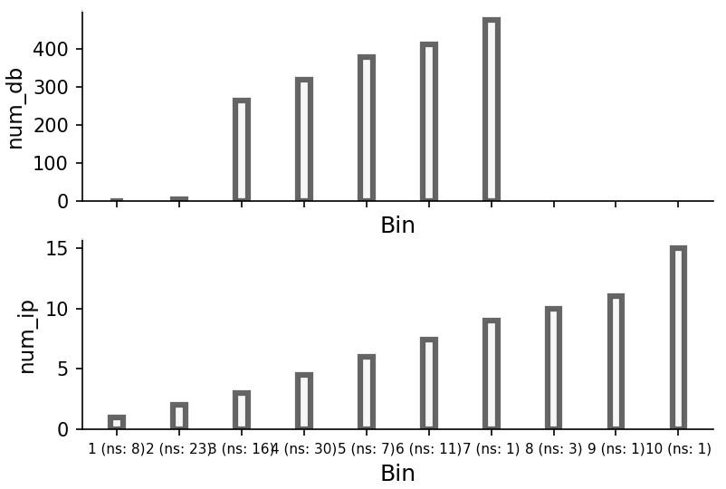

We try to find the relationship between the number of interaction sites in proteins and their interaction partners. An example file is `ex.txt`. It looks like

``` text
prot_name	chain_name	num_db	num_ip
1fft	A	273	3
1fft	B	314	2
1fft	C	0	2
...
3d31	C	0	2
3eam	A	1	2
```

!!! info

    num_db: number of interaction sites from databases.
    num_ip: number of interaction partners.

:material-language-python: Python
``` py linenums="1"
import pypropel as pp

from pypropel.util.Reader import Reader as pfreader
df = pfreader().generic(to('data/binning/ex.txt'), header=0)
print(df)

fig, axes = plt.subplots(nrows=2, ncols=1, figsize=(6, 4), sharey=False, sharex='all')
pp.plot.binning(
    df=df,
    key='num_db',
    num_bins=10,
    ax=axes[0],
).draw()
pp.plot.binning(
    df=df,
    key='num_ip',
    num_bins=10,
    ax=axes[1],
).draw()
plt.show()
```

<figure markdown="span">
  { width="600" }
  <figcaption><strong>Fig</strong> 1. Binning of interaction sites and partners</figcaption>
</figure>